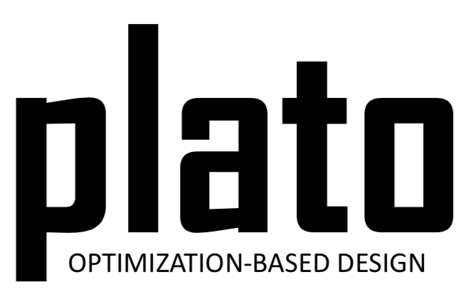

.. Plato Documentation documentation master file, created by
   sphinx-quickstart on Tue Jul 20 11:39:24 2021.
   You can adapt this file completely to your liking, but it should at least
   contain the root `toctree` directive.

Welcome to Plato's documentation!
=================================

   This is the caption of the figure (a simple paragraph).

**Plato Analyze** is an open source C++ library tool to perform fast physics with gradients for multidisciplinary analysis and optimization.

.. note::

   The Plato Analyze code can be accessed at the `PlatoAnalyze Github repository <https://github.com/platoengine/platoanalyze.git/>`_.

The following shows how to create a table

   +-----------------------+-----------------------+
   | Developer             | Role                  |
   +=======================+=======================+
   | name                  | role                  |
   +-----------------------+-----------------------+
   | name                  | role                  |
   +-----------------------+-----------------------+
   | name                  | role                  |
   +-----------------------+-----------------------+

This is an example of some math

:math:`\alpha > \beta`

.. math::

    n_{\mathrm{offset}} = \sum_{k=0}^{N-1} s_k n_k

Contents
--------

.. toctree::
   :maxdepth: 2

   inputdeck

Indices and tables
==================

* :ref:`genindex`
* :ref:`modindex`
* :ref:`search`
